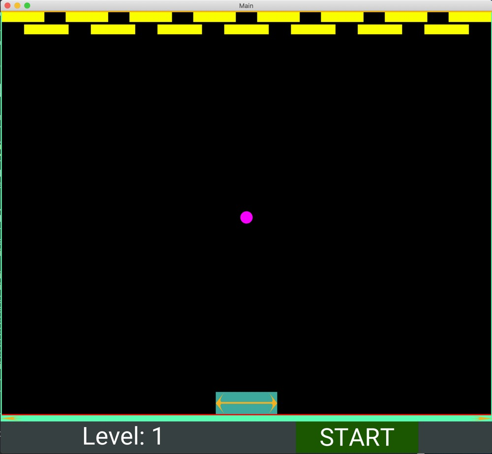

# Hit the Block
A game with graphic interface that allows users to control the paddle with mouse to deflect the ball so as to hit as many blocks as possible in order to keep the ball from hitting the bottom as well as to get to next level.

It serves as the final assignment of 10.009 Digital World.



[Link to demo video](https://www.youtube.com/watch?v=TcWWvUSAIoo)
## Dependency

- Python
- Kivy
- Libdw

and the dependencies of all above

## Run the game 

After fulfill the dependencies, in the cloned directory, in your favorite shell:
```shell
python3 main.py 
```

## Play the game 

### Basic rules

- To start, click the *START* button.
- drag the cyan-color paddle or the bottom half of the screen (but above the frame ui), and try your best to deflect the ball to hit the blocks.
- After clearing the level and prompted with *'LEVEL PASSED'*, click the *START* button to proceed to next level.
- If you want to restart the level during game, click the *STOP* button.

### Additional Informations

- Each time the ball hits either the paddle or the ceiling, the velocity on y axis will raise by 0.03x.
- If the velocity gets too high (travels beyond the border in a single frame), it counts as lost. Although your eyes probably will not be able to follow that fast a thing.
- Even the very sides of the paddle may not completely offset the velocity of the ball on x axis, so manage it carefully.
- Practice makes perfect.

## The code

### class MainApp
> The class which the app is instantiated. 

- loads kivy language with kivy Builder, which describes initial user interface and interactions.
- set the root widget to be updated 64 times per second to achieve stable 60hz refresh rate.
- return the root widget.

### class MainGame
> subclass of kivy App, root widget of the game 

- instantiate an Velocity_sm instance to track game level and ball initial velocity.
- declare the classes described in kivy language.
- function update:
    - resizing window to avoid display bugs from resizing window in the progress
    - call the move function of the ball base on its velocity
    - call bounce_ball function of the paddle 
    - check if the blocks are hit and if the level is cleared
    - adjust the velocity of the ball depending on its position
- function start:
    - centralize the ball and paddle
    - set the initial velocity of the ball base on level of the game 
    - update the appearance of the button and the label
- function stop:
    - reset the ball velocity to 0
    - reset all the blocks 
    - update the appearance of the button and the label

### class Velocity_sm
> subclass of libdw.sm, get track of game level and Velocity 

- Instantiated when game is instantiated
- upon proceeding to next level, current level and velocity are provided as arguments (state and input) to get the next state value.

### class StartButton
> subclass of kivy Button

- bound to function toggle to toggle between gaming and stopped state.

### class Spacing 
> subclass of kivy widget 

- acts as compartment to separate the blocks in the BoxLayout. 
- has the same color as the background

## Known issues

- The BoxLayout gets bugged out when attempting to zoom out the window, leaving misplaced block canvas. Window resizing is thus blocked as for now.

## LICENSE
Licensed under the [MIT license](./LICENSE)
